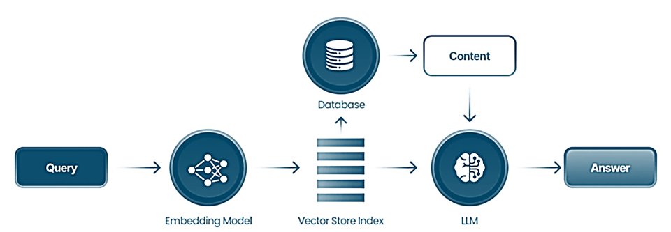

# Healtcare Chatbot with RAG Framework (MVP)
## DATA3710 & DATA3750 - Applied AI & Data Science Project

### Project title: 
Bruk av Retrieval Augmented Generation (RAG- modeller) i Utviklingen av en LLM-basert Chatbot for helserelaterte spørsmål.

**Deadline**: 20.November (soft) , 22.November (hard)

**Deliverables**: Functional healthcare chatbot prototype using the RAG framework and a 4-5,000 page academic report.

### Team members: 
* Sirin Koca,
* Morten Nilsen,
* Valerie Smidt,
* Rafey-Ul-Islam-Afzal,
* Younes Benhaida


### Project description: 
Prosjektet vil starte med å utforske hvordan man både kjører og trener lokale språkmodeller på GPU-servere ved OsloMet. 
At modellene er lokale er avgjørende med tanke på sensitive data. Et viktig aspekt er såkalte "hallusinisasjoner" hvor språkmodeller som ChatGPT kommer med svar som er fullstendig gale. Et av målene med RAG-modeller er å begrense hallusinasjoner så mye som mulig. Et viktig mål med prosjektet er å redusere mengden hallusinasjoner så mye som mulig.
	
### Project Overview:
* Develop a healthcare chatbot that leverages the RAG (Retrieval-Augmented Generation) framework to generate responses based on research articles in both Norwegian and English.
* The chatbot should use LLMs (Large Language Models) to generate responses while retrieving relevant documents from a vector database like Milvus.
* The goal is to minimize hallucinations (incorrect or fabricated information) by grounding the responses in actual research.

### Key Phases:
* Fase 1. Data Collection & Preprocessing: Gathering research articles, preprocessing them for use in a vector database.
* Fase 2. Model Choice, Testing & Evaluation: Testing different models to see how well they retrieve and generate responses.
* Fase 3. System Integration: Integrating all components like the LLM, RAG framework, vector database (Milvus), and possibly a knowledge graph (Neo4j).
* Fase 4. Chatbot Development (Backend & Frontend): Building the actual chatbot to interact with users in both English and Norwegian.
* Fase 5. Testing of the final product (MVP): Pytest 
* Fase 6. Final delivery of the product and the academic report

### Final Deliverable:
* A functional healthcare chatbot.
* A 4-5,000-page academic report detailing the process, findings, architecture, and conclusions.
* Det forventes at prosjektet resulterer både i en fungerende chatbot og i en rapport som beskriver resultater fra testkjøringer, spesielt med tanke på hallusinasjoner.

### Main Components of the MVP:
1.	**User Interface**: Where users interact with the chatbot.
2.	**API Gateway**: A middleware that connects the front-end (UI) with the back-end logic.
3.	**RAG Framework**: A combination of retrieval and generation steps for answering user queries.
4.	**Vector Database** (Milvus): Stores the embeddings of documents for retrieval.
5.	**LLM (Large Language Model)**: Generates the response using the retrieved documents.
6.	**Knowledge Graph** (Optional): Neo4j, used for more structured data querying.

# Tentative System Architecture
### Data Pipeline: 
User → API Gateway → Language Detection → Query → Embeddings Model → Vector Database → RAG Context Generation → LLM → Response → Hallucination Testing → User Output.

## How does it work? 

_Markovate. (n.d.). Advanced RAG techniques, 2024. [Markovate](https://markovate.com/blog/advanced-rag-techniques/)_

---

## Fase1️⃣: DATA COLLECTION and PREPROCESSING
```
Grunnleggende Dataforberedelses-operasjoner i et Data Science-prosjekt

1. Datavask
Håndtering av Manglende Data: Identifisere og håndtere manglende data ved enten å fylle ut, interpolere, eller fjerne rader/kolonner.
Outlier Deteksjon: Identifisere og potensielt fjerne avvik som kan påvirke modellens ytelse negativt.
Datakonvertering: Sikre at all data har riktig format (f.eks. konvertering av strenger til datoer eller tall).
Tekstnormalisering: For tekstdata, kan normalisering innebære å endre til små bokstaver, fjerne tegnsetting, og stemming/lemmatisering.

2. Utforskende Dataanalyse (EDA: Exploratory Data Analysis)
Dette er en prosess der vi analyserer og visualiserer data for å oppdage mønstre, oppsummere hovedkarakteristikker, og sjekke for avvik eller
manglende data. EDA brukes ofte som et første skritt i dataanalyse for å forstå strukturen, fordelingen, og forholdene i datasettet før vi går
videre til mer avanserte analysemetoder eller modellering.

Grunnleggende Statistikk: Beregne beskrivende statistikk som gjennomsnitt, median, modus, og standardavvik.
Visualiseringer: Lage grunnleggende diagrammer (f.eks. histogrammer, boksdiagrammer) for å forstå datadistribusjoner og forhold mellom variabler.
Korrelasjonsanalyse: Analysere korrelasjoner mellom ulike variabler for å identifisere potensielle sammenhenger som kan være nyttige for modellering.

3. Dataintegrasjon
Sammenslåing av Datasett: Kombinere ulike datasett (f.eks. slå sammen akademiske artikler med emnetagger) basert på en felles nøkkel eller indeks.
Dataaggregering: Aggregere data på forskjellige nivåer (f.eks. månedlige gjennomsnitt) for å forstå trender eller for tidsserieanalyse.

4. Datafiltrering og Sampling
Filtrering av Relevant Data: Behold kun data som er relevant for prosjektets omfang, som f.eks. å velge spesifikke AI-emner, rammeverk eller ML-modeller.
Datasampling: I tilfelle av store datasett kan sampling være nødvendig for å gjøre beregninger mer håndterbare under innledende eksperimenter.

5. Datatransformasjon
Funksjonsutvikling: Skape nye funksjoner som kan forbedre modellens ytelse, som å trekke ut nøkkelord, oppsummere tekst, eller lage dummyvariabler fra kategoriske data.
Skalering/Normalisering: Anvende skalering (f.eks. Min-Max Scaling, Standard Scaling) på numerisk data for å sikre at den passer innenfor et standardområde,
noe som er avgjørende for mange maskinlæringsalgoritmer.
Vektorisering: Tekstdata kan konverteres til numeriske vektorer (vector embeddings) ved hjelp av teknikker som TF-IDF, Word2Vec, eller BERT-innbygginger.

```

### Fase2️⃣: Model choice & eval
### Fase3️⃣: System integration
### Fase4️⃣: Chatbot development: Backend and Frontend
### Fase5️⃣: Testing - Pytest
### Fase6️⃣: Final delivery

---

Sirin Koca | Group Project | OsloMet 2024

